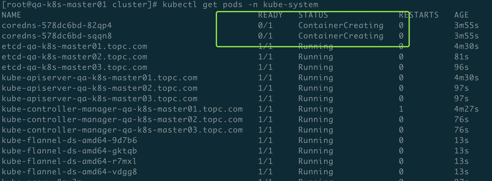
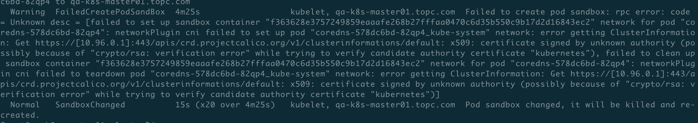
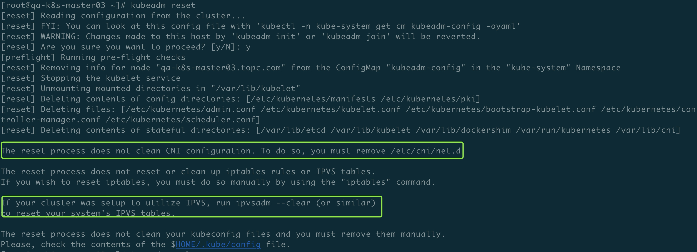

## 环境

```
CentOS Linux release 7.6.1810 (Core)
```
## Install Epel 
yum install epel-release -y

## Install Ansible
yum install ansible -y

## ANSIBLE 

```
// I'm using Ansible version 2.6.2 and solution with host_key_checking = false doesn't work.

// Adding environment variable export ANSIBLE_HOST_KEY_CHECKING=False skipping fingerprint check.

export ANSIBLE_HOST_KEY_CHECKING=False
```
### 秘钥登录
ssh-keygen

```
// copy to other nodes

ssh-copy-id  root@10.57.1.202
```

## Insall
```
主要模块介绍说明。
```
###  全局配置文件
```
/etc/ansible/inventory
```
### 系统初始化和安全加固
> role: sys_init

```
例如文件描述符限制， 劫持 crontab -r 命令等
```
> role: bash

```
重新编译bash， 支持命令行记录功能。

[root@qa-k8s-master01 ~]# tail -n 1 /var/log/messages
Mar 29 10:54:04 qa-k8s-master01 -bash: HISTORY: PPID=7126 PID=7128 SID=7128 UID=0 User=root CMD=tail -n 1 /var/log/messages
```
### 安装 docker
```
sed -i '/\[Service\]/aExecStartPost=/usr/sbin/iptables -P FORWARD ACCEPT' /usr/lib/systemd/system/docker.service 解决docker 重启 FORWARD 默认规则为DROP的问题。
```


### install kubelet
```
自己编译的 kubeadm 执行文件， 解决默认10年证书有效期的问题。
```

### 新安装 k8s集群

```
cd /etc/ansible/playbook/k8s/cluster/

ansible-playbook  deploy_kubernetes_cluster.yml -i /etc/ansible/inventory
```
### 向集群里新增一个节点

```
cd /etc/ansible/playbook/k8s/new_node

ansible-playbook add_new_node.yml -i /etc/ansible/inventory
```

### fannel 网络插件安装后出现pod无法创建问题


```
// 检查出错原因
kubectl describe pods coredns-578dc6bd-82qp4 -n kube-system
```


```
搞了很久， 重新弄个纯净环境， 一切正常。 那么问题肯定是出现环境上。

因为我之前安装k8s集群用的是 calico 网络插件， 然后执行了 kubeadm reset 重置集群，切换安装集群用 fannel 网络插件， 然后执行该命令的时候， 有个很重要的步骤我没有做。
```


```
// 执行
mv  /etc/cni/net.d/* /tmp/
ipvsadm --clear

再来一次， 一切正常。
```

